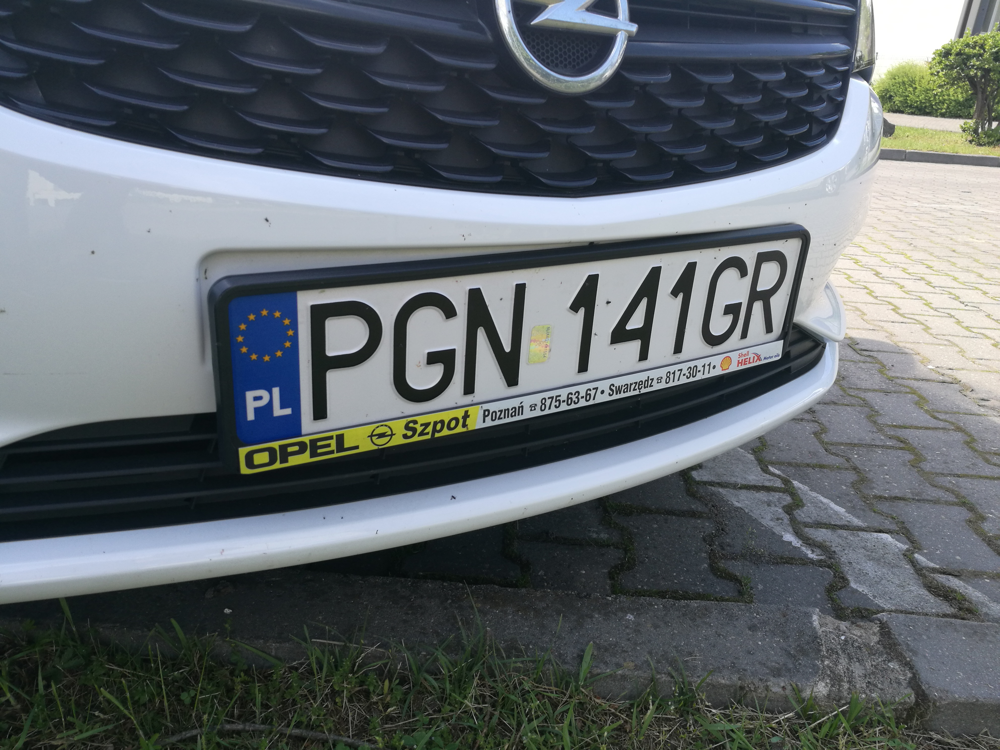
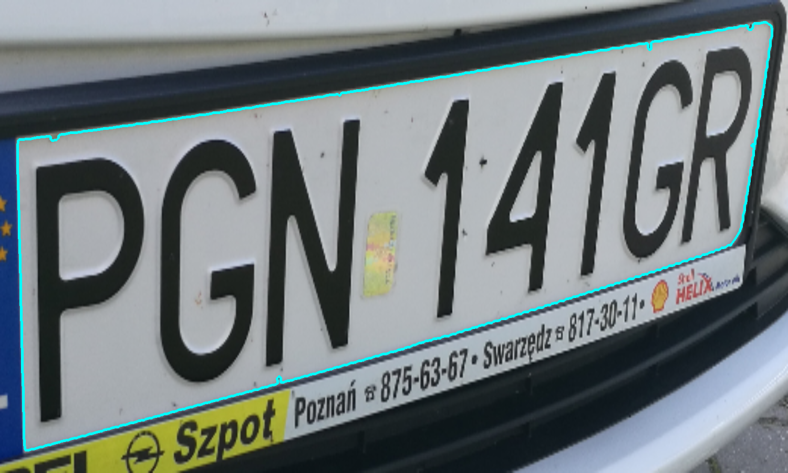
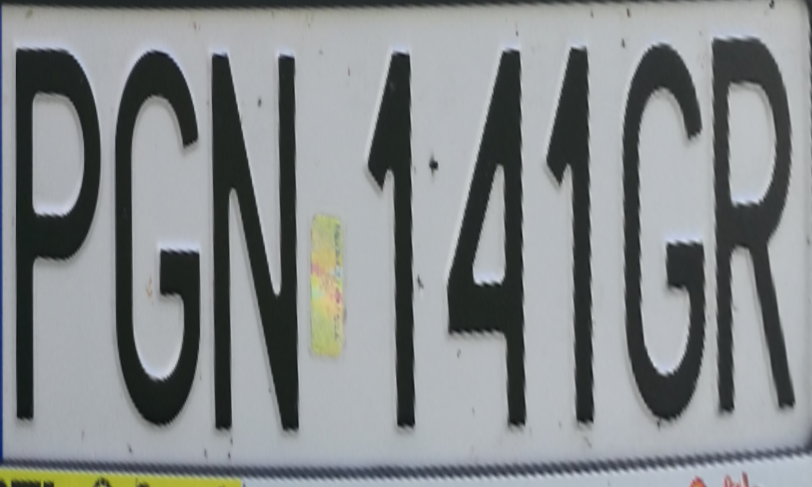
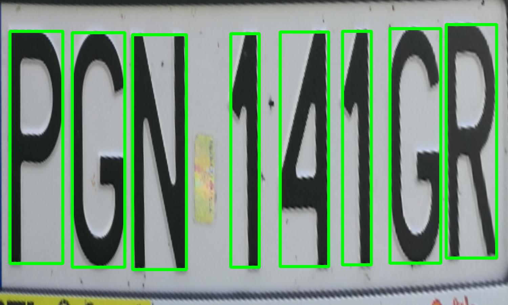
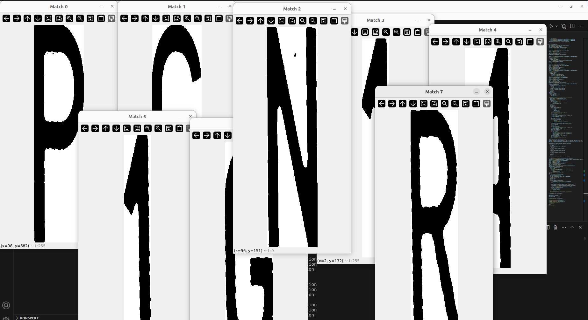
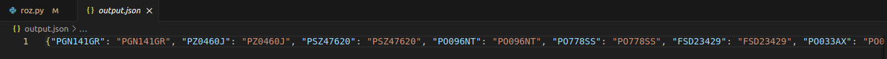

# License Plate Recognition
## 🚀 Introduction
In my project I wanted to recognize license plates using image processing methods without using ML or AI methods

## 📷 How does it work?
Example photo of a car whose license plate we want to recognize. 

After preliminary processing of the photo, we obtain the frame of the license plate.

In the next step, we determine the corners and change the perspective of the photo. 

In the next step, we detect each letter individually and display it in a separate window. 

Using 'matchTemplate', we detect the appropriate character and save it to a JSON file. 

Thanks to 'checker.py', we verify the obtained results.

## 🏆 Results
I achieved 97% accuracy

